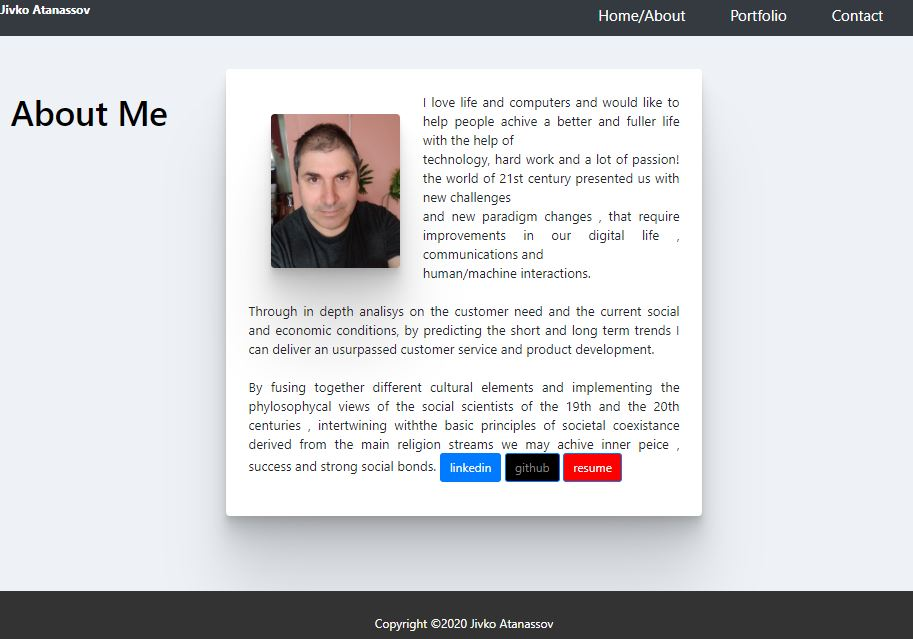

Instructions

1. [Updated Portfolio](#updated-portfolio)
2. [GitHub Profile](#updated-github-profile)
3. [Updated Resume](#updated-resume)
4. [Updated LinkedIn](#updated-linkedin)

  Updated Portfolio

Your updated site should have the following content:

* Your name

* Links to your GitHub profile & LinkedIn page as well as your email address and phone number

* A link to a PDF of your resume

* A list of projects. For each project, make sure you have the following:

  * Project title

  * Link to the deployed version

  * Link to the GitHub repository

  * Screenshot of the deployed application

  Design

Unfortunately, this is where it gets a little bit subjective. Your site should look
"polished." Here are a few guidelines on what that means:

* Mobile-first design

* Choose a color palette for your site so it doesn't just look like
the default bootstrap theme or an unstyled HTML site.

* Make sure the font size is large enough to read, and that the colors don't cause eye strain.

  Updated GitHub Profile 

* If you haven't yet, now is the time to update the following in your GitHub profile: 

    * Profile picture

    * Bio

    * Location

    * Email

    * Link to your portfolio

[link to this portfolio](https://github.com/zhim57/portfolioJuly)
[link to the deployed application](https://zhim57.github.io/portfolioJuly)

